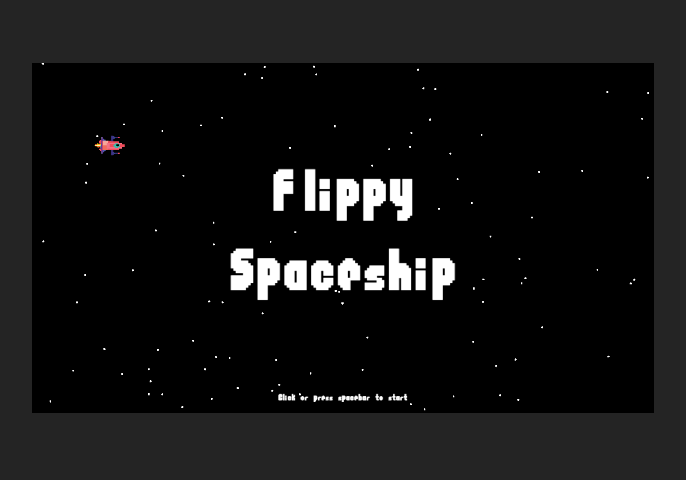

# Flippy Spaceship - A Pixi-React v8 Game

   

**Flippy Spaceship** is a re-skinned version of the classic Flappy Bird game, featuring a space theme. Built using the latest [Pixi-React v8 Beta](https://github.com/pixijs/pixi-react/tree/beta), this project brings a fresh and engaging look to the familiar gameplay.

This project was submitted to Dev.to’s [Web Game Challenge](https://dev.to/challenges/webgame), Build a Game: Alien Edition.

Inspired by and translated from the original project, [Flappy Bird Game (Vue3 and PixiJS)](https://github.com/hairyf/vue3-pixi-flappy-bird/tree/main), I ported the codebase to React and leveraged the Pixi-React library to showcase its capabilities.

Check out the [Live Demo](https://flippy-spaceship.vercel.app). Use mouse clicks or the spacebar to play.

<p align="center">
  
</p>

---

## Getting Started

### 1. Install Dependencies
First, ensure all project dependencies are installed:

```bash
pnpm install
```

### 2. Run the Development Server
To start the game in development mode, run:

```bash
pnpm run dev
```

Then, open your browser and go to `http://localhost:5173` to start playing the game.


## TODO
- Add simple spaceship animation
- Incorporate sound effects and background music
- Implement high score saving and loading
- Add a wormhole mechanic to advance the player over a set distance
- Introduce floating quantum cores as an in-game currency
- Create a shop where players can buy new spaceship skins


## Free Asset Credits

- [Retro Pixel Rocket Vector by brgfx](https://www.freepik.com/free-vector/retro-pixel-rocket-vector_50448014.htm)
- [Rock Pixel Art by leesons](https://www.cleanpng.com/png-clip-art-rock-portable-network-graphics-computer-i-6940406/)
- [Flappy Bird Font by Font Co.](https://www.fontspace.com/flappy-bird-font-f21349)


## License

This project is licensed under the [MIT LICENSE](./LICENSE).
© 2024-PRESENT [furic](https://github.com/furic)
